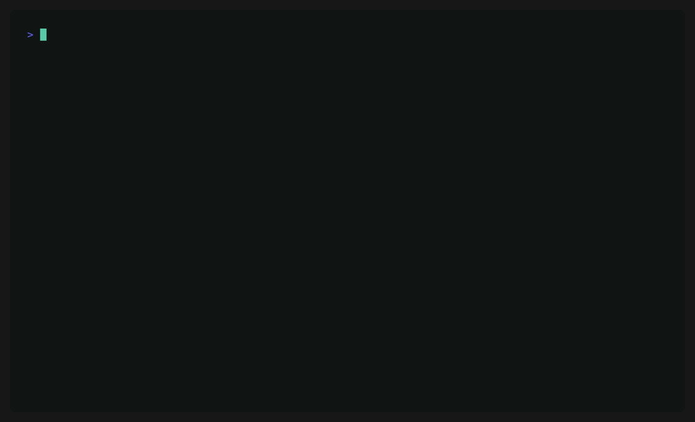

<div align="center">

# session.link

**Turn any LLM session — an eval item, an agent trace, a one-off completion — into a permanent, shareable URL you can inspect.**

[](https://www.npmjs.com/package/session.link)
[](https://www.npmjs.com/package/session.link)
[](https://github.com/lftherios/session-link/actions)
[](packages/format)
[](LICENSE)



**[▶ Open a real captured session →](https://session.link/r/agent-eval)**

</div>

## Why

Agent runs are ephemeral. When something interesting happens — a clever tool call, a wrong turn, a great eval result — your options are a screenshot that loses the tree, timing, and cost, or a wall of pasted JSON nobody will read. `slink` gives you a third option: **a link.** Capture is ambient and local; publishing is deliberate; the result is a permanent page a teammate can actually open.

## Quickstart

```bash
# 1. Record — wrap your agent. Nothing leaves your machine.
npx session.link dev -- python agent.py

# 2. Publish — validate, secret-scan, one confirmation, a permanent link.
npx session.link push
# → https://session.link/r/9f3kx2mvq7wt   (copied to your clipboard)
```

That's it — no code changes, no SDK, no account required to capture. `dev` points `ANTHROPIC_BASE_URL` / `OPENAI_BASE_URL` at a local recording proxy, runs your command, and writes each call to `~/.slink` as it happens. Streaming is passed through untouched and reassembled. Optionally `npx session.link login` (GitHub) first, so published sessions are attributed to you.

Node agent instead? `slink dev -- node agent.js`. Already ran it — in Claude Code, Codex, opencode, pi, or Hermes? `slink import` reconstructs the session from your agent's own history ([see below](#works-with-the-agent-you-already-use)). Want to review before sharing? `slink open` browses your captures locally in the exact viewer the hosted site renders, with a Publish button on the page.

**Always on?** Instead of wrapping each run, leave `slink tap` running — a persistent recorder that segments every session flowing through it into its own capture. `eval "$(slink on)"` routes this shell's agents at it, so capture becomes a background fact; publish any session later with `slink share`.

> Install today is npm (`npx session.link`, or `npm i -g session.link` for a global `slink`). Standalone `brew` / `curl | sh` binaries are coming soon.

## Works with the agent you already use

Didn't wrap it in `slink dev`? Import it after the fact. `slink import` reconstructs a `session/v0` capture straight from your coding agent's own on-disk history — no proxy, no re-run. With no arguments it grabs the newest session for the current project, whichever agent produced it; `--from` pins one:

| Agent | Where its sessions live | Import |
| --- | --- | --- |
|  &nbsp;[Claude Code](https://claude.com/claude-code) | `~/.claude/projects/…` (JSONL) | `slink import --from claude-code` |
|  &nbsp;[Codex](https://github.com/openai/codex) | `~/.codex/sessions/**/rollout-*.jsonl` | `slink import --from codex` |
|  &nbsp;[opencode](https://opencode.ai) | `~/.local/share/opencode/opencode.db` (SQLite) | `slink import --from opencode` |
|  &nbsp;[pi](https://github.com/badlogic/pi-mono) | `~/.pi/agent/sessions/…` (JSONL) | `slink import --from pi` |
|  &nbsp;[Hermes](https://github.com/NousResearch/hermes-agent) | `~/.hermes/state.db` (SQLite) | `slink import --from hermes` |

```bash
# newest session in this repo, whichever agent produced it → a link
slink share
```

Imports are marked **`fidelity: reconstructed`** — the transcript carries the messages, tool calls, models, and token usage, but not the raw wire request bodies (a capture from `slink dev` is `exact`). The SQLite-backed stores (opencode, Hermes) need Node ≥ 22.

**pi, live.** The [`@session-link/pi-extension`](packages/pi-extension) adds a `/slink` command to pi — publish the session you're in without leaving the TUI, at **`exact`** fidelity: it records each turn from pi's in-process SDK hooks, assembled system prompt and verbatim provider request included.

## What a shared link gives you

A published session isn't a screenshot — it's the real thing, rendered:

- 🌳 **An interactive trace tree** with a timing micro-waterfall — spans colored by kind (llm_call, tool_call, retrieval, agent), collapsible, navigable.
- 💬 **Formatted messages** — system / user / assistant / thinking / tool calls, with a **Raw JSON** toggle one click away (normalization is never lossy; the raw payload is preserved).
- 📊 **Token, cost, latency, and score chips** rolled up per run and per span.
- 🔗 **`#span=` deep links** — point a teammate at step 14, not "scroll down a bit."
- 💌 **Slack / OG unfurls** — the link describes itself in chat, no click required.

## Private by design

`slink` runs in the path of your prompts and API keys, so it's built to be safe to run on real work:

- **Capture is 100% local.** A recording proxy tees the calls to disk; nothing is uploaded until you run `push`.
- **Secrets are scanned twice** — client-side before a single byte leaves your machine, and again server-side before anything touches disk (`sk-…`, `ghp_…`, `AKIA…`, Stripe keys, PEM blocks). A hit blocks the publish.
- **Sessions are immutable and content-addressed** — the exact bytes are served back, so anyone can verify the hash. Deletion is a clean tombstone, never a silent edit.
- **Unlisted by default** — ~66 bits of unguessable URL, no public index, crawlers excluded. You decide what gets shared, one link at a time.

## What's in the box

An open client and an open format, not a thin wrapper around a hosted API:

| Package | What it is |
| --- | --- |
| [`session.link`](packages/cli) | the `slink` CLI — recording proxy, importer, local viewer, publish flow. Zero-dependency bundle. |
| [`@session-link/format`](packages/format) | the open `session/v0` format — TypeScript types, JSON Schema, and `validateRun`. |
| [`@session-link/viewer`](packages/viewer) | the React trace-tree component that renders a session — the same one the hosted site uses. Embed it. |

The `session/v0` wire format is open-world: unknown span types, content parts, roles, and extra fields all validate and round-trip, so it degrades gracefully as providers and frameworks evolve. It's pre-1.0 and will change before it's frozen.

## Roadmap

Today, one link lets you **inspect**. Next, anchored to the same URLs:

- **Remix** — fork any call into a playground, change the prompt or model, re-run on your own key. *(soon)*
- **Compare** — diff two runs sharing a `group` id; scores line up on their own. *(soon)*
- **Discuss** — comments that anchor to spans, not screenshots. *(soon)*

## Contributing

Issues and PRs welcome. `npm install`, then `npm test` (CLI + format + viewer) and `npm run build:cli`. The demo GIF regenerates from a checked-in [VHS](https://github.com/charmbracelet/vhs) tape: `vhs assets/demo.tape`.

The hosted service lives at **[session.link](https://session.link)**; this repo is the open client and format.

## License

MIT © [lftherios](https://github.com/lftherios) — see [LICENSE](LICENSE).

---

Also on [Radicle](https://radicle.xyz), the peer-to-peer code network:

```
rad:z24FnLsshNV8kq5fWCTi2dbKueomr
```

Clone it with `rad clone rad:z24FnLsshNV8kq5fWCTi2dbKueomr`.
